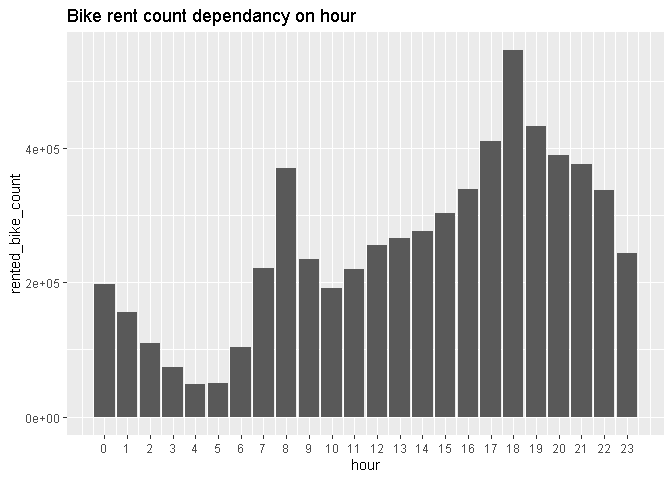
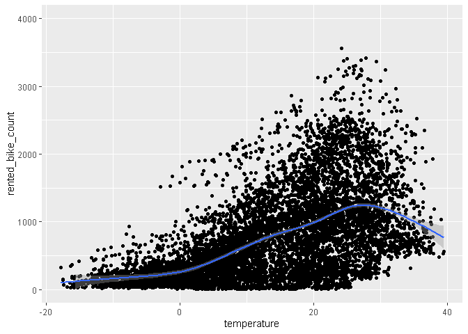
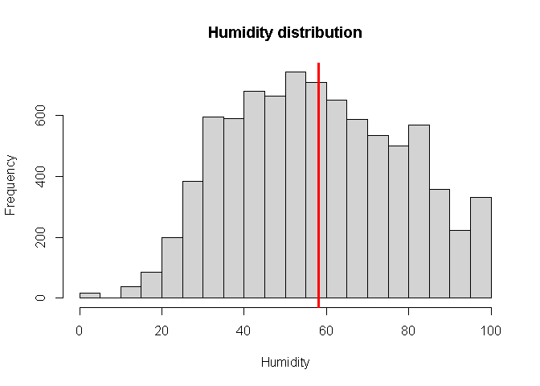
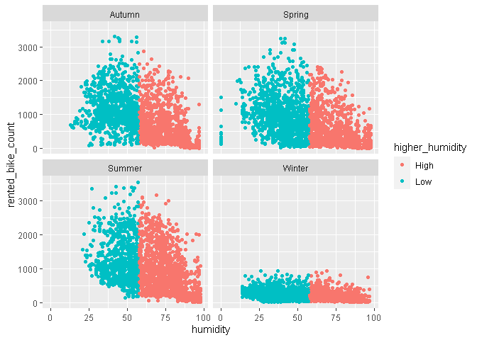
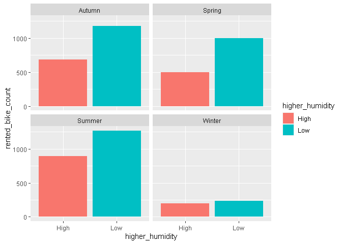
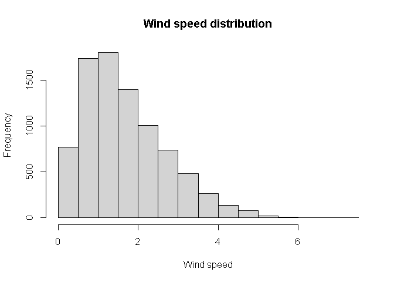
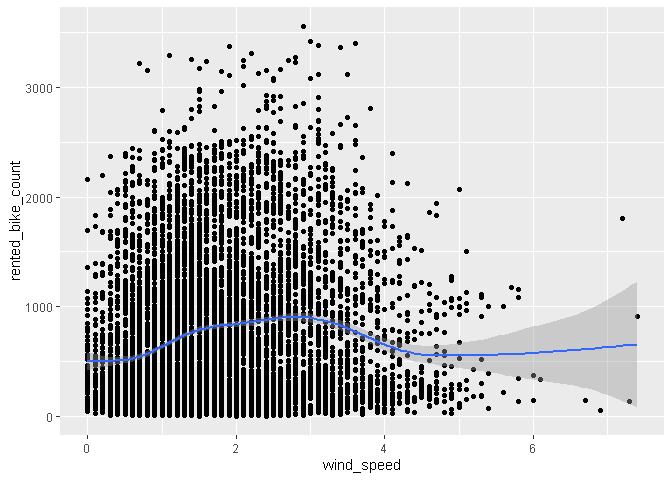
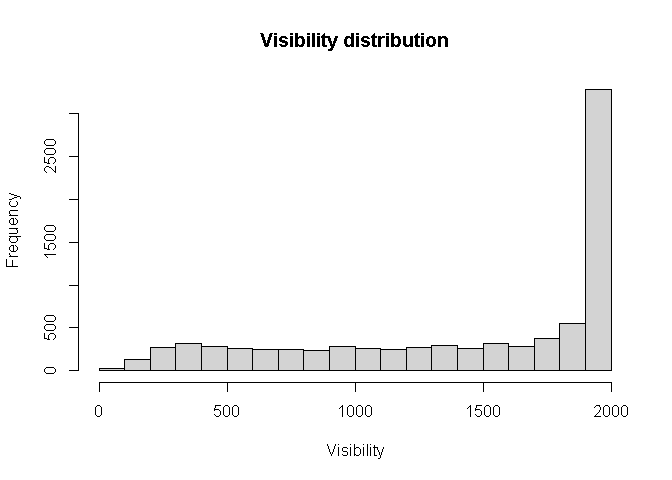
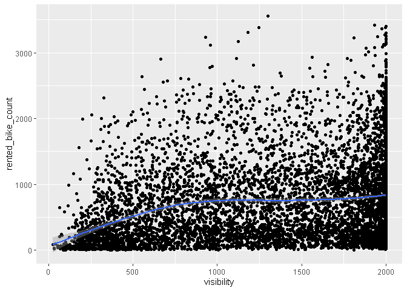

Seoul bike rent analysis (still in progress)
================
Rokas

Last compiled on 19 June, 2022

<style>
body {
  color: #blue;
  font-family: Calibri;
  background-color: #lightblue;
}
pre {
  color: #708090;
  background-color: #F8F8FF;
}
</style>

# Dataset Attributes

Identifier

-   Id - The Unique Integer Id for every entry in data set

Other variables (columns)

-   Date - dd/mm/yyyy (String)
-   Hour - Hour of the day (int)
-   Temperature - Temperature(°C)
-   Humidity - Humidity (%)
-   Wind_Speed - Wind Speed (m/s)
-   Visibility - Visibility ( 10m range)
-   Dew_Point - Dew Point Temperature(°C)
-   Solar_Radiation - Solar Radiation (MJ/m^2)
-   Rainfall - Rainfall (mm)
-   Snowfall - Snowfall (mm)

Categorical Variables (columns)

-   Season - Winter, Spring, Summer and Autumn
-   IsHoliday - Yes/No stands for Holiday/No Holiday for Public Holidays
    from the South Korean Public Holidays List
-   IsFunctioningDay - Yes/No stands for Yes/No to Whether the Hour in
    the entry is a functioning hour (work hour) of the day or not.

Target variable (column)

-   Bikes_Rented - Number of Bikes Rented in the Hour of the Day with
    Specified parameters. Dataset Attributes

Identifiers

    Id - The Unique Integer Id for every entry in both sets

Other columns

    Date - dd/mm/yyyy String for Date
    Hour - int, Hour of the day
    Temperature - Temperature in Degree Celsius
    Humidity - % of Humidity
    Wind_Speed - Wind Speed in m/s
    Visibility - Visibility in 10m range
    Dew_Point - Dew Point Temperature in Degree Celsius
    Solar_Radiation - Solar Radiation in MJ/m^2
    Rainfall - Rainfall in mm
    Snowfall - Snowfall in mm

Categorical Columns

    Season - Winter, Spring, Summer & Autumn
    IsHoliday - 1/0 for Holiday/No Holiday for Public Holidays from the South Korean Public Holidays List
    IsFunctioningDay - 1/0 for Yes/No to Whether the Hour in the entry is a functioning hour (work hour) of the day or not.

Target Column

    Bikes_Rented - Number of Bikes Rented in the Hour of the Day with Specified parameters.

## Libraries

``` r
library(Hmisc)
library(corrplot)
library(plyr)
library(dplyr)
library(scales)
library(viridis)
library(lubridate)
library(knitr)
library(caTools)
library(leaps)
library(cvms)  #fro confusion matrix
library(earth) #for mars model
library(caret) # for mars tuning and cross-validation
library(vip)    # for variable importance plots(vips)
library(rpart)  #for decision trees
library(gam) #for GAMs
library(gbm) #for gbm
library(Metrics) #for gbm
library(xgboost)
library(rstatix)  #for outliers identification
```

## Exploratory analysis

Reading a file as a data frame and checking its structure and summary

``` r
seoul_bike <- read.csv("raw_seoul_bike_sharing.csv")
str(seoul_bike)
```

    ## 'data.frame':    8760 obs. of  14 variables:
    ##  $ Date                 : chr  "01/12/2017" "01/12/2017" "01/12/2017" "01/12/2017" ...
    ##  $ RENTED_BIKE_COUNT    : int  254 204 173 107 78 100 181 460 930 490 ...
    ##  $ Hour                 : int  0 1 2 3 4 5 6 7 8 9 ...
    ##  $ TEMPERATURE          : num  -5.2 -5.5 -6 -6.2 -6 -6.4 -6.6 -7.4 -7.6 -6.5 ...
    ##  $ HUMIDITY             : int  37 38 39 40 36 37 35 38 37 27 ...
    ##  $ WIND_SPEED           : num  2.2 0.8 1 0.9 2.3 1.5 1.3 0.9 1.1 0.5 ...
    ##  $ Visibility           : int  2000 2000 2000 2000 2000 2000 2000 2000 2000 1928 ...
    ##  $ DEW_POINT_TEMPERATURE: num  -17.6 -17.6 -17.7 -17.6 -18.6 -18.7 -19.5 -19.3 -19.8 -22.4 ...
    ##  $ SOLAR_RADIATION      : num  0 0 0 0 0 0 0 0 0.01 0.23 ...
    ##  $ RAINFALL             : num  0 0 0 0 0 0 0 0 0 0 ...
    ##  $ Snowfall             : num  0 0 0 0 0 0 0 0 0 0 ...
    ##  $ SEASONS              : chr  "Winter" "Winter" "Winter" "Winter" ...
    ##  $ HOLIDAY              : chr  "No Holiday" "No Holiday" "No Holiday" "No Holiday" ...
    ##  $ FUNCTIONING_DAY      : chr  "Yes" "Yes" "Yes" "Yes" ...

``` r
summary(seoul_bike)
```

    ##      Date           RENTED_BIKE_COUNT      Hour        TEMPERATURE    
    ##  Length:8760        Min.   :   2.0    Min.   : 0.00   Min.   :-17.80  
    ##  Class :character   1st Qu.: 214.0    1st Qu.: 5.75   1st Qu.:  3.40  
    ##  Mode  :character   Median : 542.0    Median :11.50   Median : 13.70  
    ##                     Mean   : 729.2    Mean   :11.50   Mean   : 12.87  
    ##                     3rd Qu.:1084.0    3rd Qu.:17.25   3rd Qu.: 22.50  
    ##                     Max.   :3556.0    Max.   :23.00   Max.   : 39.40  
    ##                     NA's   :295                       NA's   :11      
    ##     HUMIDITY       WIND_SPEED      Visibility   DEW_POINT_TEMPERATURE
    ##  Min.   : 0.00   Min.   :0.000   Min.   :  27   Min.   :-30.600      
    ##  1st Qu.:42.00   1st Qu.:0.900   1st Qu.: 940   1st Qu.: -4.700      
    ##  Median :57.00   Median :1.500   Median :1698   Median :  5.100      
    ##  Mean   :58.23   Mean   :1.725   Mean   :1437   Mean   :  4.074      
    ##  3rd Qu.:74.00   3rd Qu.:2.300   3rd Qu.:2000   3rd Qu.: 14.800      
    ##  Max.   :98.00   Max.   :7.400   Max.   :2000   Max.   : 27.200      
    ##                                                                      
    ##  SOLAR_RADIATION     RAINFALL          Snowfall         SEASONS         
    ##  Min.   :0.0000   Min.   : 0.0000   Min.   :0.00000   Length:8760       
    ##  1st Qu.:0.0000   1st Qu.: 0.0000   1st Qu.:0.00000   Class :character  
    ##  Median :0.0100   Median : 0.0000   Median :0.00000   Mode  :character  
    ##  Mean   :0.5691   Mean   : 0.1487   Mean   :0.07507                     
    ##  3rd Qu.:0.9300   3rd Qu.: 0.0000   3rd Qu.:0.00000                     
    ##  Max.   :3.5200   Max.   :35.0000   Max.   :8.80000                     
    ##                                                                         
    ##    HOLIDAY          FUNCTIONING_DAY   
    ##  Length:8760        Length:8760       
    ##  Class :character   Class :character  
    ##  Mode  :character   Mode  :character  
    ##                                       
    ##                                       
    ##                                       
    ## 

Data frame consists of `14` variables or columns and `8760` observations
or rows. Let’s look for `NA` values first and remove them by saving it
in the new data frame. There are `295` NA values of
`RENTED_BIKE_COlUMN`, and `11 NA` values of `TEMPERATURE`. I can remove
them.

``` r
sapply(seoul_bike, function(x) sum(is.na(x)))
```

    ##                  Date     RENTED_BIKE_COUNT                  Hour 
    ##                     0                   295                     0 
    ##           TEMPERATURE              HUMIDITY            WIND_SPEED 
    ##                    11                     0                     0 
    ##            Visibility DEW_POINT_TEMPERATURE       SOLAR_RADIATION 
    ##                     0                     0                     0 
    ##              RAINFALL              Snowfall               SEASONS 
    ##                     0                     0                     0 
    ##               HOLIDAY       FUNCTIONING_DAY 
    ##                     0                     0

``` r
clean_bike <- na.omit(seoul_bike)
str(clean_bike)
```

    ## 'data.frame':    8454 obs. of  14 variables:
    ##  $ Date                 : chr  "01/12/2017" "01/12/2017" "01/12/2017" "01/12/2017" ...
    ##  $ RENTED_BIKE_COUNT    : int  254 204 173 107 78 100 181 460 930 490 ...
    ##  $ Hour                 : int  0 1 2 3 4 5 6 7 8 9 ...
    ##  $ TEMPERATURE          : num  -5.2 -5.5 -6 -6.2 -6 -6.4 -6.6 -7.4 -7.6 -6.5 ...
    ##  $ HUMIDITY             : int  37 38 39 40 36 37 35 38 37 27 ...
    ##  $ WIND_SPEED           : num  2.2 0.8 1 0.9 2.3 1.5 1.3 0.9 1.1 0.5 ...
    ##  $ Visibility           : int  2000 2000 2000 2000 2000 2000 2000 2000 2000 1928 ...
    ##  $ DEW_POINT_TEMPERATURE: num  -17.6 -17.6 -17.7 -17.6 -18.6 -18.7 -19.5 -19.3 -19.8 -22.4 ...
    ##  $ SOLAR_RADIATION      : num  0 0 0 0 0 0 0 0 0.01 0.23 ...
    ##  $ RAINFALL             : num  0 0 0 0 0 0 0 0 0 0 ...
    ##  $ Snowfall             : num  0 0 0 0 0 0 0 0 0 0 ...
    ##  $ SEASONS              : chr  "Winter" "Winter" "Winter" "Winter" ...
    ##  $ HOLIDAY              : chr  "No Holiday" "No Holiday" "No Holiday" "No Holiday" ...
    ##  $ FUNCTIONING_DAY      : chr  "Yes" "Yes" "Yes" "Yes" ...
    ##  - attr(*, "na.action")= 'omit' Named int [1:306] 3145 3146 3147 3148 3149 3150 3151 3152 3153 3154 ...
    ##   ..- attr(*, "names")= chr [1:306] "3145" "3146" "3147" "3148" ...

All the names of `14` variables are converted to lower cases for
convenience.

``` r
names(clean_bike) <- tolower(names(clean_bike))
names(clean_bike)
```

    ##  [1] "date"                  "rented_bike_count"     "hour"                 
    ##  [4] "temperature"           "humidity"              "wind_speed"           
    ##  [7] "visibility"            "dew_point_temperature" "solar_radiation"      
    ## [10] "rainfall"              "snowfall"              "seasons"              
    ## [13] "holiday"               "functioning_day"

By using a `lubridate` package date is converted from char format to
date format with `dmy` function.(day/month/year). Also categorical
variable `holiday` is changed to numerical values for calculations and
`seasons` names are changed to factors. New variable `day` added to
`clean_bike` data frame to name weekdays for analysis. Weekdays are
converted to factors as well.

``` r
clean_bike$date <- dmy(clean_bike$date)
clean_bike$holiday <- ifelse(clean_bike$holiday == 'No Holiday' ,0, 1)
#clean_bike$seasons <- recode(clean_bike$seasons, 'Winter'= 1, 'Spring'= 2, 'Summer'= 3, 'Autumn'= 4)
clean_bike$seasons <- as.factor(clean_bike$seasons)
class(clean_bike$seasons)
```

    ## [1] "factor"

``` r
clean_bike$day <- weekdays(as.Date(clean_bike$date))
clean_bike$day <- as.factor(clean_bike$day)
```

By using `table` function it is possible now to count all the values. It
is clear now that `functioning day` has only 1 value. It means that
bikes are rented in Seoul any time of the year and any time of the day.
So I can remove this variable from the `clean_bike` data frame .

``` r
table(clean_bike$functioning_day)
```

    ## 
    ##  Yes 
    ## 8454

``` r
pie(table(clean_bike$holiday), labels=c("No","Yes"))
```

<!-- -->

``` r
table(clean_bike$holiday)
```

    ## 
    ##    0    1 
    ## 8046  408

``` r
pie(table(clean_bike$seasons), labels=c("Winter","Spring","Summer","Autumn"))
```

<!-- -->

``` r
table(clean_bike$seasons)
```

    ## 
    ## Autumn Spring Summer Winter 
    ##   1937   2160   2197   2160

``` r
pie(table(clean_bike$day),labels=c("Monday","Tuesday","Wednesday","Thursday","Friday","Saturday","Sunday"))
```

<!-- -->

``` r
table(clean_bike$day)
```

    ## 
    ##    Friday    Monday  Saturday    Sunday  Thursday   Tuesday Wednesday 
    ##      1224      1248      1215      1223      1197      1150      1197

``` r
clean_bike <- clean_bike %>% select(-functioning_day)
```

Now I can calculate correlation and look for variables that correlate
the most with `rented_bike_count`. In other words, we are looking for
the most paramount factors for bike rent. Also `dew_point_temperature`
is removed because it highly correlates with temperature and for
predictive analysis it won’t be useful. One `temperature` variable is
enough for analysis.

``` r
corrplot(cor(clean_bike[c(2:11)]),type = "upper",col=COL2("RdBu",100))
```


``` r
clean_bike <- clean_bike %>% select(-dew_point_temperature)
```

With the help of `grouping`, `average_bike_rent_coount` and
`average_temperature` is calculated per month and year since there is
one month of 2017. The most bikes were rented during June `n=1237` and
September `n=1079` and temperatures `T1=23.1` and `T2=21.7` accordingly.

``` r
rent_by_year <- clean_bike %>%
  mutate(year= year(clean_bike$date), month=month(clean_bike$date)) %>%
  group_by(year, month) %>%
  summarise(total = sum(rented_bike_count), average_bike_rent_count = mean(rented_bike_count), average_temperature = mean(temperature))
kable(rent_by_year)
```

| year | month |  total | average_bike_rent_count | average_temperature |
|-----:|------:|-------:|------------------------:|--------------------:|
| 2017 |    12 | 185330 |                249.0995 |           -1.928763 |
| 2018 |     1 | 150006 |                201.6210 |           -3.943145 |
| 2018 |     2 | 151833 |                225.9420 |           -1.664732 |
| 2018 |     3 | 380594 |                511.5511 |            8.044409 |
| 2018 |     4 | 524227 |                753.1997 |           12.950776 |
| 2018 |     5 | 707088 |                982.0667 |           18.233417 |
| 2018 |     6 | 883541 |               1237.4524 |           23.116106 |
| 2018 |     7 | 732059 |                989.2689 |           27.775676 |
| 2018 |     8 | 650610 |                875.6528 |           28.740646 |
| 2018 |     9 | 673612 |               1079.5064 |           21.748718 |
| 2018 |    10 | 650675 |                978.4586 |           12.675188 |
| 2018 |    11 | 465715 |                718.6960 |            7.364506 |

Furthermore, seasonal bike rental analysis is carried out by using
`date` and `seasons` variables in addition. It is evident that bike rent
is highly dependent on the temperature. The lowest rent numbers are
generated during the winter and highest in the summer. Also other was
made with highlighted `holiday` points. There is no visual difference of
bike rent during the holidays, so we can ignore it, during the analysis.

# Seasonal

``` r
ggplot(clean_bike, aes( x=date, y =rented_bike_count, color= temperature)) + geom_point() +
  facet_wrap(~seasons, scales = "free_x") +
ylab('Count of Rented Bikes')  +
xlab('Date') +
ggtitle('Seasonal Bike Rent Dependency in Seoul')  + 
 scale_fill_viridis(direction = -1)+
  scale_colour_viridis_c(option = "plasma")
```


``` r
highlight <- clean_bike %>% filter(holiday==1)

  ggplot(clean_bike, aes( x=date, y =rented_bike_count, color= temperature)) + geom_point(alpha=0.3) +
 geom_point(data= highlight , aes(x=date, y =rented_bike_count), color ='black', size=4) +
ylab('Count of Rented Bikes')  +
xlab('Date') +
ggtitle('Seasonal Bike Rent Dependency in Seoul with highlighted holidays')  + 
    scale_fill_viridis(direction = -1)+
  scale_colour_viridis_c(option = "plasma")
```


# Hour

After Using `table` function on `hour` variable it is clear that each
hour has the same amount of records. The bar plots shows hourly rented
bike dependency. The least amount bikes is rented 4 in the morning.
There is a spiking in a graph during 8 in the morning. It is probably
due to people going to work. The highest number of bikes rented is at
the 18th hour. Around that time people finish working in Korea, so they
are going home after work.

``` r
table(clean_bike$hour)
```

    ## 
    ##   0   1   2   3   4   5   6   7   8   9  10  11  12  13  14  15  16  17  18  19 
    ## 352 352 352 352 351 352 351 353 353 352 352 353 353 352 352 353 353 351 352 352 
    ##  20  21  22  23 
    ## 353 353 353 352

``` r
ggplot(clean_bike, aes(x= hour, y = rented_bike_count)) + geom_col() +  scale_x_continuous(breaks=seq(0,23,1)) + ggtitle("Bike rent count dependancy on hour")
```

<!-- -->

Let’s look for an outliers for each hour with the help of `boxplot`,
`dplyr` package and `indtify_outliers` function, which looks for
outliers with the help of first and third `quantiles` and `IQR`. 2
outlier points ar visible from the boxplot. After printing all the
records with these outliers, we can see that there is nothing special
about them, so they are removed using `anti-join`

``` r
ggplot(clean_bike, aes(x= hour, y = rented_bike_count)) + geom_boxplot(aes(group = hour)) +  scale_x_continuous(breaks=seq(0,23,1)) +
  coord_flip() + ggtitle("Bike rent count dependancy on hour")
```

<!-- -->

``` r
outliers_hour <- clean_bike %>%
  group_by(hour) %>%
  identify_outliers(rented_bike_count)
outliers_hour
```

    ## # A tibble: 2 x 15
    ##    hour date       rented_bike_count temperature humidity wind_speed visibility
    ##   <int> <date>                 <int>       <dbl>    <int>      <dbl>      <int>
    ## 1     2 2018-06-24              1254        20.9       87        1.8        222
    ## 2     4 2018-06-13               421        18.7       74        0.9       1933
    ## # ... with 8 more variables: solar_radiation <dbl>, rainfall <dbl>,
    ## #   snowfall <dbl>, seasons <fct>, holiday <dbl>, day <fct>, is.outlier <lgl>,
    ## #   is.extreme <lgl>

``` r
clean_bike <- clean_bike %>% anti_join(outliers_hour, by = c( "hour", "rented_bike_count"))
```

Very obvious pattern is observed when analyzing hourly bike rent by the
day. During weekends graphs are much smoother(ne peaks, like on
weekdays) observed due to the fact that majority of people don’t work on
Saturday and Sunday.

``` r
ggplot(clean_bike, aes(x= hour, y = rented_bike_count, fill = day)) + geom_col() +
scale_x_continuous(breaks=seq(0,23,2))+ facet_wrap(~day) + theme(legend.position='none' ) + ggtitle("Daily bike rent count dependancy on hour")
```

<!-- -->

Moving on, there is obvious correlation between temperature and bike
rent that already has been shown in the table and seasonal bike rent
graph. Temperature distribution is closest to the normal distribution,
it is visible in the `histogram`. in the scatter plot of `temperature`
vs `rented_bike_count` with the help of fitting nonlinear line with
`smooth` function, a clear trend is observed of rent numbers rising
until temperature of around 29 degrees is reached and after that line
starts going down pretty rapidly due to hot weather. \# Temperature

``` r
hist(clean_bike$temperature  ,xlab= "Temperature", main= "Temperature distribution", xaxp = c(-20,40,24) )
```

<!-- -->

``` r
summary(clean_bike$temperature)
```

    ##    Min. 1st Qu.  Median    Mean 3rd Qu.    Max. 
    ##  -17.80    3.00   13.40   12.75   22.60   39.40

``` r
ggplot(clean_bike, aes(temperature, rented_bike_count)) + geom_point() + ylim(0,4000) +geom_smooth()
```

    ## `geom_smooth()` using method = 'gam' and formula 'y ~ s(x, bs = "cs")'

<!-- -->

\#humidity

`Humidity` distribution is a little bit more left-skewed compared to
‘temperature’s’ one but it still close to normal distribution. So mean
as a metric will be used for analysis of high and low humidity marked as
a red line in the `histogram`. New variable `higher` is created inspect
how rent numbers numbers alter when humidity is higher then average and
lower and the data is saved in the new data frame hum.
`Rented_bike_count` decreases the closer humidity approaches 100 percent
humidity. By comparing their averages, it is visible, that average bike
rent count drops when there is high humidity quite a lot(mostly probably
due to rain, fog or other phenomena).

``` r
hist(clean_bike$humidity  ,xlab= "Humidity", main= "Humidity distribution" )
abline(v = mean(clean_bike$humidity),                       
       col = "red",
       lwd = 3)
```

<!-- -->

``` r
hum <- clean_bike %>%
  mutate(higher_humidity= humidity > median(humidity))
 hum$higher_humidity<- as.factor(ifelse(hum$higher == TRUE, "High", "Low"))

 
  hum1_low <- hum   %>%
   group_by(seasons, higher_humidity)%>%
   summarize(mean=mean(rented_bike_count),count = n())
```

    ## `summarise()` has grouped output by 'seasons'. You can override using the
    ## `.groups` argument.

``` r
ggplot(hum, aes(humidity, rented_bike_count, color = higher_humidity)) + geom_point() + facet_wrap(~seasons)
```

<!-- -->

``` r
ggplot(hum, aes(higher_humidity, rented_bike_count, fill = higher_humidity)) + geom_bar( stat = "summary", fun = "mean") + facet_wrap(~seasons)
```

<!-- -->

# wind_speed

Since Seoul is a big city with not many open areas, it has average
`wind_speed` of `2 m/s`, which is very low and the highest `7.4` which
is still classified as low wind, so we can see in the numbers that there
is a small change in bike rent numbers when speed reaches wind speeds
close to `4 m/s`, but is pretty rare event.

``` r
hist(clean_bike$wind_speed  ,xlab= "Wind speed", main= "Wind speed distribution" )
```

<!-- -->

``` r
ggplot(clean_bike, aes(wind_speed, rented_bike_count)) + geom_point() + geom_smooth()
```

    ## `geom_smooth()` using method = 'gam' and formula 'y ~ s(x, bs = "cs")'

<!-- -->

``` r
summary(clean_bike$wind_speed )
```

    ##    Min. 1st Qu.  Median    Mean 3rd Qu.    Max. 
    ##   0.000   0.900   1.500   1.726   2.300   7.400

# visibility

Big part of visibility data is distributed towards high visibility. Only
when visibility is close 0 then rent numbers are really low, but there
are a few data points of a very low visibility, and from 700 and higher,
bike rent count stabilizes.

``` r
hist(clean_bike$visibility ,xlab= "Visibility", main= "Visibility distribution" )
```

<!-- -->

``` r
ggplot(clean_bike, aes(visibility, rented_bike_count)) + geom_point() + geom_smooth()
```

    ## `geom_smooth()` using method = 'gam' and formula 'y ~ s(x, bs = "cs")'

<!-- --> \# solar radiation

## Modeling analysis

Data is split into training and test data sets with 70/30 % ratio

``` r
split = sort(sample(nrow(clean_bike), nrow(clean_bike)*.7))
train<-clean_bike[split,]
test<-clean_bike[-split,]
dim(train)
```

    ## [1] 5916   13

``` r
dim(test)
```

    ## [1] 2536   13

``` r
glimpse(train)
```

    ## Rows: 5,916
    ## Columns: 13
    ## $ date              <date> 2017-12-01, 2017-12-01, 2017-12-01, 2017-12-01, 201~
    ## $ rented_bike_count <int> 254, 204, 173, 107, 78, 100, 181, 451, 555, 600, 426~
    ## $ hour              <int> 0, 1, 2, 3, 4, 5, 6, 13, 17, 19, 20, 22, 0, 1, 2, 3,~
    ## $ temperature       <dbl> -5.2, -5.5, -6.0, -6.2, -6.0, -6.4, -6.6, 2.4, 0.8, ~
    ## $ humidity          <int> 37, 38, 39, 40, 36, 37, 35, 25, 58, 77, 79, 83, 87, ~
    ## $ wind_speed        <dbl> 2.2, 0.8, 1.0, 0.9, 2.3, 1.5, 1.3, 1.6, 1.6, 1.7, 1.~
    ## $ visibility        <int> 2000, 2000, 2000, 2000, 2000, 2000, 2000, 2000, 2000~
    ## $ solar_radiation   <dbl> 0.00, 0.00, 0.00, 0.00, 0.00, 0.00, 0.00, 1.16, 0.08~
    ## $ rainfall          <dbl> 0, 0, 0, 0, 0, 0, 0, 0, 0, 0, 0, 0, 0, 0, 0, 0, 0, 0~
    ## $ snowfall          <dbl> 0, 0, 0, 0, 0, 0, 0, 0, 0, 0, 0, 0, 0, 0, 0, 0, 0, 0~
    ## $ seasons           <fct> Winter, Winter, Winter, Winter, Winter, Winter, Wint~
    ## $ holiday           <dbl> 0, 0, 0, 0, 0, 0, 0, 0, 0, 0, 0, 0, 0, 0, 0, 0, 0, 0~
    ## $ day               <fct> Friday, Friday, Friday, Friday, Friday, Friday, Frid~

# Mars

MARS

``` r
marsm <- earth(rented_bike_count ~ ., data = train, degree = 1)


marsm
summary(marsm)
plot(marsm, which = 1)
axis(1, at = 1:20)

knitr::knit_exit()
```

``` r
hyper_grid <- expand.grid(
  degree = 1:3, 
  nprune = seq(2, 30, length.out = 10) %>% floor()
  )

tuned_mars <- train(
  x = subset(train, select = -rented_bike_count),
  y = train$rented_bike_count,
  method = "earth",
  metric = "RMSE",
  trControl = trainControl(method = "cv", number = 10),
  tuneGrid = hyper_grid
)
tuned_mars$bestTune

ggplot(tuned_mars)+
  scale_x_continuous(breaks = seq(0, 30, by = 5))


p1 <- vip(tuned_mars, num_features = 20, bar = FALSE, value = "gcv") + ggtitle("GCV")
p2 <- vip(tuned_mars, num_features = 20, bar = FALSE, value = "rss") + ggtitle("RSS")

gridExtra::grid.arrange(p1, p2, ncol = 2)
```

# decisions tree

``` r
treem <- rpart(rented_bike_count ~ ., 
             method = "anova", data = train)
treem
```

    ## n= 5916 
    ## 
    ## node), split, n, deviance, yval
    ##       * denotes terminal node
    ## 
    ##   1) root 5916 2463860000  727.7179  
    ##     2) temperature< 10.95 2627  278104100  349.4187  
    ##       4) date< 17595.5 1604   37825600  228.6091 *
    ##       5) date>=17595.5 1023  180162300  538.8407  
    ##        10) hour< 6.5 416   11381370  250.9423 *
    ##        11) hour>=6.5 607  110669900  736.1483 *
    ##     3) temperature>=10.95 3289 1509525000 1029.8740  
    ##       6) hour< 15.5 2119  475176300  748.8259  
    ##        12) solar_radiation< 0.205 964  102146800  448.7884  
    ##          24) hour>=1.5 714   58230050  352.8641 *
    ##          25) hour< 1.5 250   18583450  722.7480 *
    ##        13) solar_radiation>=0.205 1155  213817100  999.2468 *
    ##       7) hour>=15.5 1170  563836400 1538.8840  
    ##        14) humidity>=83.5 119   27412710  400.7059 *
    ##        15) humidity< 83.5 1051  364810600 1667.7550  
    ##          30) temperature< 16.35 219   44379610 1251.4610 *
    ##          31) temperature>=16.35 832  272488300 1777.3320  
    ##            62) hour>=22.5 77    3842392 1220.9740 *
    ##            63) hour< 22.5 755  242381100 1834.0730  
    ##             126) hour< 16.5 129   26059650 1380.8060 *
    ##             127) hour>=16.5 626  184356800 1927.4780 *

``` r
plot(treem, uniform = TRUE,
          main = "... 
                 Tree using Regression")
text(treem, use.n = TRUE, cex = .7)
```

<!-- -->

``` r
# Step 1 - create the evaluation metrics function


eval_results <- function(true, predicted, df) {

  SSE <- sum((predicted - true)^2)

  SST <- sum((true - mean(true))^2)

  R_square <- 1 - SSE / SST

  RMSE = sqrt(SSE/nrow(df))

  

# Model performance metrics

  data.frame(

    RMSE = RMSE,

    Rsquare = R_square

  )

  

}


# Step 2 - predicting and evaluating the model on train data


predictions_train_cart = predict(treem, data = train)

eval_results(train$rented_bike_count, predictions_train_cart, train)
```

    ##       RMSE  Rsquare
    ## 1 352.8495 0.701055

``` r
# Step 3 - predicting and evaluating the model on test data


predictions_test_cart = predict(treem, newdata = test)

eval_results(test$rented_bike_count, predictions_test_cart, test)
```

    ##       RMSE   Rsquare
    ## 1 348.8524 0.6946247

# gam model

``` r
GAMsm <- gam(rented_bike_count ~ .,data = train)
summary(GAMsm)
```

    ## 
    ## Call: gam(formula = rented_bike_count ~ ., data = train)
    ## Deviance Residuals:
    ##      Min       1Q   Median       3Q      Max 
    ## -1149.13  -284.39   -54.07   213.10  2196.81 
    ## 
    ## (Dispersion Parameter for gaussian family taken to be 185929.6)
    ## 
    ##     Null Deviance: 2463860050 on 5915 degrees of freedom
    ## Residual Deviance: 1096241189 on 5896 degrees of freedom
    ## AIC: 88590.41 
    ## 
    ## Number of Local Scoring Iterations: 2 
    ## 
    ## Anova for Parametric Effects
    ##                   Df     Sum Sq   Mean Sq   F value    Pr(>F)    
    ## date               1  375422100 375422100 2019.1621 < 2.2e-16 ***
    ## hour               1  458417772 458417772 2465.5443 < 2.2e-16 ***
    ## temperature        1  301222856 301222856 1620.0905 < 2.2e-16 ***
    ## humidity           1  125777972 125777972  676.4815 < 2.2e-16 ***
    ## wind_speed         1      14127     14127    0.0760 0.7828310    
    ## visibility         1    2207435   2207435   11.8724 0.0005737 ***
    ## solar_radiation    1   15502982  15502982   83.3809 < 2.2e-16 ***
    ## rainfall           1   27542449  27542449  148.1337 < 2.2e-16 ***
    ## snowfall           1     692387    692387    3.7239 0.0536863 .  
    ## seasons            3   41633222  13877741   74.6397 < 2.2e-16 ***
    ## holiday            1    4316907   4316907   23.2180 1.483e-06 ***
    ## day                6   14868653   2478109   13.3282 4.622e-15 ***
    ## Residuals       5896 1096241189    185930                        
    ## ---
    ## Signif. codes:  0 '***' 0.001 '**' 0.01 '*' 0.05 '.' 0.1 ' ' 1

# GBM

``` r
model_gbm <- gbm(formula = rented_bike_count ~.,
                data = train[,c(-1,-13)],
                distribution = "gaussian",
               cv.folds = 5,
               interaction.depth = 2,
                shrinkage = .01,
                n.minobsinnode = 10,
                n.trees = 5000,
               n.cores = NULL, # will use all cores by defaul
               verbose = FALSE)
 

print(model_gbm)
```

    ## gbm(formula = rented_bike_count ~ ., distribution = "gaussian", 
    ##     data = train[, c(-1, -13)], n.trees = 5000, interaction.depth = 2, 
    ##     n.minobsinnode = 10, shrinkage = 0.01, cv.folds = 5, verbose = FALSE, 
    ##     n.cores = NULL)
    ## A gradient boosted model with gaussian loss function.
    ## 5000 iterations were performed.
    ## The best cross-validation iteration was 5000.
    ## There were 10 predictors of which 10 had non-zero influence.

``` r
# model performance
perf_gbm1 = gbm.perf(model_gbm, method = "cv")
print(perf_gbm1)
```

    ## [1] 5000

``` r
bike_prediction_1 <- stats::predict(
                           # the model from above
                          object = model_gbm, 
                          # the testing data
                          newdata = test,
                          # this is the number we calculated above
                          n.trees = perf_gbm1)

rmse_fit1 <- Metrics::rmse(actual = test$rented_bike_count, 
                           predicted = bike_prediction_1)


print(rmse_fit1)
```

    ## [1] 247.1093

``` r
min_MSE <- which.min(model_gbm$cv.error)

# get MSE and compute RMSE
sqrt(model_gbm$cv.error[min_MSE])
```

    ## [1] 253.0821

``` r
## [1] 23112.1

# plot loss function as a result of n trees added to the ensemble
gbm.perf( model_gbm, method = "cv")
```

<!-- -->

    ## [1] 5000

# XGboost

``` r
X_train = data.matrix(train[,-2])                  # independent variables for train
y_train = train[,2]                                # dependent variables for train
  
X_test = data.matrix(test[,-2])                    # independent variables for test
y_test = test[,2]                                   # dependent variables for test

# convert the train and test data into xgboost matrix type.
xgboost_train = xgb.DMatrix(data=X_train, label=y_train)
xgboost_test = xgb.DMatrix(data=X_test, label=y_test)


xgm <- xgboost(data = xgboost_train,                    # the data   
                 max.depth=3,                # max depth 
               scale_pos_weight = 1, 
               early_stopping_rounds = 3,
               mode="regression",
                 nrounds=5000)                              # max number of boosting iterations

summary(xgm)
xgm

#pred_test <- predict(xgm, xgboost_test)

#pred_test
```

# Time-series forecast
