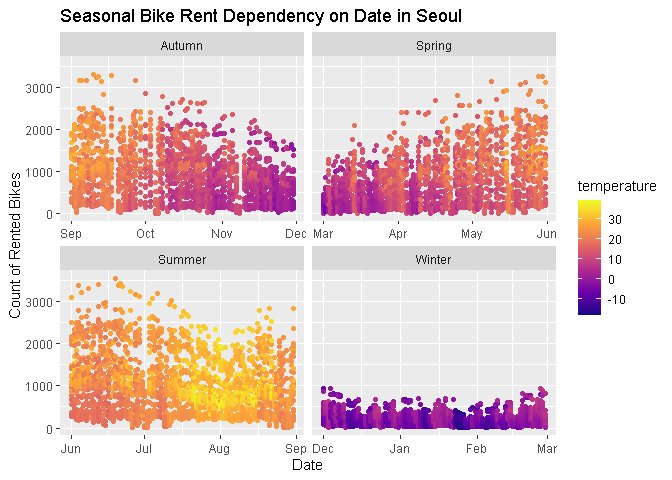
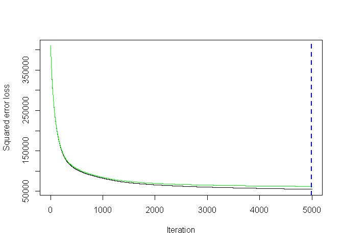

Seoul bike rent analysis (still in progress)
================
Rokas

Last compiled on 07 June, 2022

<style>
body {
  color: #gray;
  font-family: Calibri;
  background-color: #lightblue;
}
pre {
  color: #708090;
  background-color: #F8F8FF;
}
</style>

# Dataset Attributes

Identifier

-   Id - The Unique Integer Id for every entry in data set

Other variables (columns)

-   Date - dd/mm/yyyy (String)
-   Hour - Hour of the day (int)
-   Temperature - Temperature(°C)
-   Humidity - Humidity (%)
-   Wind_Speed - Wind Speed (m/s)
-   Visibility - Visibility ( 10m range)
-   Dew_Point - Dew Point Temperature(°C)
-   Solar_Radiation - Solar Radiation (MJ/m^2)
-   Rainfall - Rainfall (mm)
-   Snowfall - Snowfall (mm)

Categorical Variables (columns)

-   Season - Winter, Spring, Summer and Autumn
-   IsHoliday - Yes/No stands for Holiday/No Holiday for Public Holidays
    from the South Korean Public Holidays List
-   IsFunctioningDay - Yes/No stands for Yes/No to Whether the Hour in
    the entry is a functioning hour (work hour) of the day or not.

Target variable (column)

-   Bikes_Rented - Number of Bikes Rented in the Hour of the Day with
    Specified parameters. Dataset Attributes

Identifiers

    Id - The Unique Integer Id for every entry in both sets

Other columns

    Date - dd/mm/yyyy String for Date
    Hour - int, Hour of the day
    Temperature - Temperature in Degree Celsius
    Humidity - % of Humidity
    Wind_Speed - Wind Speed in m/s
    Visibility - Visibility in 10m range
    Dew_Point - Dew Point Temperature in Degree Celsius
    Solar_Radiation - Solar Radiation in MJ/m^2
    Rainfall - Rainfall in mm
    Snowfall - Snowfall in mm

Categorical Columns

    Season - Winter, Spring, Summer & Autumn
    IsHoliday - 1/0 for Holiday/No Holiday for Public Holidays from the South Korean Public Holidays List
    IsFunctioningDay - 1/0 for Yes/No to Whether the Hour in the entry is a functioning hour (work hour) of the day or not.

Target Column

    Bikes_Rented - Number of Bikes Rented in the Hour of the Day with Specified parameters.

## Libraries

``` r
library(Hmisc)
library(corrplot)
library(plyr)
library(dplyr)
library(scales)
library(viridis)
library(lubridate)
library(knitr)
library(caTools)
library(leaps)
library(cvms)  #fro confusion matrix
library(earth) #for mars model
library(caret) # for mars tuning and cross-validation
library(vip)    # for variable importance plots(vips)
library(rpart)  #for decision trees
library(gam) #for GAMs
library(gbm) #for gbm
library(Metrics) #for gbm
library(xgboost)
```

## Exploratory analysis

Reading a file as a data.table and checking its structure and summary

``` r
seoul_bike <- read.csv("raw_seoul_bike_sharing.csv")
str(seoul_bike)
```

    ## 'data.frame':    8760 obs. of  14 variables:
    ##  $ Date                 : chr  "01/12/2017" "01/12/2017" "01/12/2017" "01/12/2017" ...
    ##  $ RENTED_BIKE_COUNT    : int  254 204 173 107 78 100 181 460 930 490 ...
    ##  $ Hour                 : int  0 1 2 3 4 5 6 7 8 9 ...
    ##  $ TEMPERATURE          : num  -5.2 -5.5 -6 -6.2 -6 -6.4 -6.6 -7.4 -7.6 -6.5 ...
    ##  $ HUMIDITY             : int  37 38 39 40 36 37 35 38 37 27 ...
    ##  $ WIND_SPEED           : num  2.2 0.8 1 0.9 2.3 1.5 1.3 0.9 1.1 0.5 ...
    ##  $ Visibility           : int  2000 2000 2000 2000 2000 2000 2000 2000 2000 1928 ...
    ##  $ DEW_POINT_TEMPERATURE: num  -17.6 -17.6 -17.7 -17.6 -18.6 -18.7 -19.5 -19.3 -19.8 -22.4 ...
    ##  $ SOLAR_RADIATION      : num  0 0 0 0 0 0 0 0 0.01 0.23 ...
    ##  $ RAINFALL             : num  0 0 0 0 0 0 0 0 0 0 ...
    ##  $ Snowfall             : num  0 0 0 0 0 0 0 0 0 0 ...
    ##  $ SEASONS              : chr  "Winter" "Winter" "Winter" "Winter" ...
    ##  $ HOLIDAY              : chr  "No Holiday" "No Holiday" "No Holiday" "No Holiday" ...
    ##  $ FUNCTIONING_DAY      : chr  "Yes" "Yes" "Yes" "Yes" ...

``` r
summary(seoul_bike)
```

    ##      Date           RENTED_BIKE_COUNT      Hour        TEMPERATURE    
    ##  Length:8760        Min.   :   2.0    Min.   : 0.00   Min.   :-17.80  
    ##  Class :character   1st Qu.: 214.0    1st Qu.: 5.75   1st Qu.:  3.40  
    ##  Mode  :character   Median : 542.0    Median :11.50   Median : 13.70  
    ##                     Mean   : 729.2    Mean   :11.50   Mean   : 12.87  
    ##                     3rd Qu.:1084.0    3rd Qu.:17.25   3rd Qu.: 22.50  
    ##                     Max.   :3556.0    Max.   :23.00   Max.   : 39.40  
    ##                     NA's   :295                       NA's   :11      
    ##     HUMIDITY       WIND_SPEED      Visibility   DEW_POINT_TEMPERATURE
    ##  Min.   : 0.00   Min.   :0.000   Min.   :  27   Min.   :-30.600      
    ##  1st Qu.:42.00   1st Qu.:0.900   1st Qu.: 940   1st Qu.: -4.700      
    ##  Median :57.00   Median :1.500   Median :1698   Median :  5.100      
    ##  Mean   :58.23   Mean   :1.725   Mean   :1437   Mean   :  4.074      
    ##  3rd Qu.:74.00   3rd Qu.:2.300   3rd Qu.:2000   3rd Qu.: 14.800      
    ##  Max.   :98.00   Max.   :7.400   Max.   :2000   Max.   : 27.200      
    ##                                                                      
    ##  SOLAR_RADIATION     RAINFALL          Snowfall         SEASONS         
    ##  Min.   :0.0000   Min.   : 0.0000   Min.   :0.00000   Length:8760       
    ##  1st Qu.:0.0000   1st Qu.: 0.0000   1st Qu.:0.00000   Class :character  
    ##  Median :0.0100   Median : 0.0000   Median :0.00000   Mode  :character  
    ##  Mean   :0.5691   Mean   : 0.1487   Mean   :0.07507                     
    ##  3rd Qu.:0.9300   3rd Qu.: 0.0000   3rd Qu.:0.00000                     
    ##  Max.   :3.5200   Max.   :35.0000   Max.   :8.80000                     
    ##                                                                         
    ##    HOLIDAY          FUNCTIONING_DAY   
    ##  Length:8760        Length:8760       
    ##  Class :character   Class :character  
    ##  Mode  :character   Mode  :character  
    ##                                       
    ##                                       
    ##                                       
    ## 

Data frame consists of `14` variables or columns and `8760` observations
or rows. Let’s look for `NA` values first and remove them by saving it
in the new data frame. There are `295` NA values of
`RENTED_BIKE_COlUMN`, and `11` `NA` values of `TEMPERATURE`. We can
remove them

``` r
sapply(seoul_bike, function(x) sum(is.na(x)))
```

    ##                  Date     RENTED_BIKE_COUNT                  Hour 
    ##                     0                   295                     0 
    ##           TEMPERATURE              HUMIDITY            WIND_SPEED 
    ##                    11                     0                     0 
    ##            Visibility DEW_POINT_TEMPERATURE       SOLAR_RADIATION 
    ##                     0                     0                     0 
    ##              RAINFALL              Snowfall               SEASONS 
    ##                     0                     0                     0 
    ##               HOLIDAY       FUNCTIONING_DAY 
    ##                     0                     0

``` r
clean_bike <- na.omit(seoul_bike)
str(clean_bike)
```

    ## 'data.frame':    8454 obs. of  14 variables:
    ##  $ Date                 : chr  "01/12/2017" "01/12/2017" "01/12/2017" "01/12/2017" ...
    ##  $ RENTED_BIKE_COUNT    : int  254 204 173 107 78 100 181 460 930 490 ...
    ##  $ Hour                 : int  0 1 2 3 4 5 6 7 8 9 ...
    ##  $ TEMPERATURE          : num  -5.2 -5.5 -6 -6.2 -6 -6.4 -6.6 -7.4 -7.6 -6.5 ...
    ##  $ HUMIDITY             : int  37 38 39 40 36 37 35 38 37 27 ...
    ##  $ WIND_SPEED           : num  2.2 0.8 1 0.9 2.3 1.5 1.3 0.9 1.1 0.5 ...
    ##  $ Visibility           : int  2000 2000 2000 2000 2000 2000 2000 2000 2000 1928 ...
    ##  $ DEW_POINT_TEMPERATURE: num  -17.6 -17.6 -17.7 -17.6 -18.6 -18.7 -19.5 -19.3 -19.8 -22.4 ...
    ##  $ SOLAR_RADIATION      : num  0 0 0 0 0 0 0 0 0.01 0.23 ...
    ##  $ RAINFALL             : num  0 0 0 0 0 0 0 0 0 0 ...
    ##  $ Snowfall             : num  0 0 0 0 0 0 0 0 0 0 ...
    ##  $ SEASONS              : chr  "Winter" "Winter" "Winter" "Winter" ...
    ##  $ HOLIDAY              : chr  "No Holiday" "No Holiday" "No Holiday" "No Holiday" ...
    ##  $ FUNCTIONING_DAY      : chr  "Yes" "Yes" "Yes" "Yes" ...
    ##  - attr(*, "na.action")= 'omit' Named int [1:306] 3145 3146 3147 3148 3149 3150 3151 3152 3153 3154 ...
    ##   ..- attr(*, "names")= chr [1:306] "3145" "3146" "3147" "3148" ...

All the names of `14` variables are converted to lower cases for
convenience.

``` r
names(clean_bike) <- tolower(names(clean_bike))
names(clean_bike)
```

    ##  [1] "date"                  "rented_bike_count"     "hour"                 
    ##  [4] "temperature"           "humidity"              "wind_speed"           
    ##  [7] "visibility"            "dew_point_temperature" "solar_radiation"      
    ## [10] "rainfall"              "snowfall"              "seasons"              
    ## [13] "holiday"               "functioning_day"

By using a `lubridate` package date is converted from char format to
date format with `dmy` function.(day/month/year). Also all categorical
character variables are changed to numerical values for calculations.
New variable `day` added to `clean_bike` data frame to name weekdays for
analysis. Weekdays are converted to numbers as well.

``` r
clean_bike$date <- dmy(clean_bike$date)
clean_bike$holiday <- ifelse(clean_bike$holiday == 'No Holiday' ,0, 1)
#clean_bike$seasons <- recode(clean_bike$seasons, 'Winter'= 1, 'Spring'= 2, 'Summer'= 3, 'Autumn'= 4)
clean_bike$seasons <- as.factor(clean_bike$seasons)
class(clean_bike$seasons)
```

    ## [1] "factor"

``` r
clean_bike$day <- weekdays(as.Date(clean_bike$date))
```

By using `table` function it is possible now to count all the values. It
is clea now that ‘functioning day’ has only 1 value. It means that bikes
are rented in Seoul any time of the year. So we can remove this variable
from the data frame ‘clean_bike’.

``` r
table(clean_bike$functioning_day)
```

    ## 
    ##  Yes 
    ## 8454

``` r
pie(table(clean_bike$holiday), labels=c("No","Yes"))
```

<!-- -->

``` r
table(clean_bike$holiday)
```

    ## 
    ##    0    1 
    ## 8046  408

``` r
pie(table(clean_bike$seasons), labels=c("Winter","Spring","Summer","Autumn"))
```

<!-- -->

``` r
table(clean_bike$seasons)
```

    ## 
    ## Autumn Spring Summer Winter 
    ##   1937   2160   2197   2160

``` r
pie(table(clean_bike$day),labels=c("Monday","Tuesday","Wednesday","Thursday","Friday","Saturday","Sunday"))
```

<!-- -->

``` r
table(clean_bike$day)
```

    ## 
    ##    Friday    Monday  Saturday    Sunday  Thursday   Tuesday Wednesday 
    ##      1224      1248      1215      1223      1197      1150      1197

``` r
clean_bike <- clean_bike %>% select(-functioning_day)
```

Now I can calculate correlation and look for variables that correlate
the most with `rented_bike_count`. In other words, we are looking for
the most paramount factors for bike rent. Also ‘dew_point_temperature’
is removed because it highly correlates with temperature and for
predictive analysis it won’t be useful. One ‘temperature’ variable is
enough for analysis. It can be seen that

``` r
corrplot(cor(clean_bike[c(2:11)]),type = "upper",col=COL2("RdBu",100))
```


``` r
clean_bike <- clean_bike %>% select(-dew_point_temperature)
```

``` r
rent_by_year <- clean_bike %>%
  mutate(year= year(clean_bike$date), month=month(clean_bike$date)) %>%
  group_by(year, month) %>%
  summarise(total = sum(rented_bike_count), average_bike_rent_count = mean(rented_bike_count), average_temperature = mean(temperature))
kable(rent_by_year)
```

| year | month |  total | average_bike_rent_count | average_temperature |
|-----:|------:|-------:|------------------------:|--------------------:|
| 2017 |    12 | 185330 |                249.0995 |           -1.928763 |
| 2018 |     1 | 150006 |                201.6210 |           -3.943145 |
| 2018 |     2 | 151833 |                225.9420 |           -1.664732 |
| 2018 |     3 | 380594 |                511.5511 |            8.044409 |
| 2018 |     4 | 524227 |                753.1997 |           12.950776 |
| 2018 |     5 | 707088 |                982.0667 |           18.233417 |
| 2018 |     6 | 883541 |               1237.4524 |           23.116106 |
| 2018 |     7 | 732059 |                989.2689 |           27.775676 |
| 2018 |     8 | 650610 |                875.6528 |           28.740646 |
| 2018 |     9 | 673612 |               1079.5064 |           21.748718 |
| 2018 |    10 | 650675 |                978.4586 |           12.675188 |
| 2018 |    11 | 465715 |                718.6960 |            7.364506 |

# Temperature

# Hour

``` r
ggplot(clean_bike, aes( x=date, y =rented_bike_count, color= temperature)) + geom_point() +
  facet_wrap(~seasons, scales = "free_x") +
ylab('Count of Rented Bikes')  +
xlab('Date') +
ggtitle('Seasonal Bike Rent Dependency on Date in Seoul')  + 
 scale_fill_viridis(direction = -1)+
  scale_colour_viridis_c(option = "plasma")
```



## Modeling analysis

Data is split into training and test data sets with 70/30 % ratio

``` r
split = sort(sample(nrow(clean_bike), nrow(clean_bike)*.7))
train<-clean_bike[split,]
test<-clean_bike[-split,]
dim(train)
```

    ## [1] 5917   13

``` r
dim(test)
```

    ## [1] 2537   13

``` r
glimpse(train)
```

    ## Rows: 5,917
    ## Columns: 13
    ## $ date              <date> 2017-12-01, 2017-12-01, 2017-12-01, 2017-12-01, 201~
    ## $ rented_bike_count <int> 254, 204, 107, 78, 930, 490, 339, 360, 451, 447, 463~
    ## $ hour              <int> 0, 1, 3, 4, 8, 9, 10, 11, 13, 14, 15, 17, 18, 19, 20~
    ## $ temperature       <dbl> -5.2, -5.5, -6.2, -6.0, -7.6, -6.5, -3.5, -0.5, 2.4,~
    ## $ humidity          <int> 37, 38, 40, 36, 37, 27, 24, 21, 25, 26, 36, 58, 66, ~
    ## $ wind_speed        <dbl> 2.2, 0.8, 0.9, 2.3, 1.1, 0.5, 1.2, 1.3, 1.6, 2.0, 3.~
    ## $ visibility        <int> 2000, 2000, 2000, 2000, 2000, 1928, 1996, 1936, 2000~
    ## $ solar_radiation   <dbl> 0.00, 0.00, 0.00, 0.00, 0.01, 0.23, 0.65, 0.94, 1.16~
    ## $ rainfall          <dbl> 0, 0, 0, 0, 0, 0, 0, 0, 0, 0, 0, 0, 0, 0, 0, 0, 0, 0~
    ## $ snowfall          <dbl> 0, 0, 0, 0, 0, 0, 0, 0, 0, 0, 0, 0, 0, 0, 0, 0, 0, 0~
    ## $ seasons           <fct> Winter, Winter, Winter, Winter, Winter, Winter, Wint~
    ## $ holiday           <dbl> 0, 0, 0, 0, 0, 0, 0, 0, 0, 0, 0, 0, 0, 0, 0, 0, 0, 0~
    ## $ day               <chr> "Friday", "Friday", "Friday", "Friday", "Friday", "F~

# Mars

MARS

``` r
marsm <- earth(rented_bike_count ~ ., data = train, degree = 1)


marsm
summary(marsm)
plot(marsm, which = 1)
axis(1, at = 1:20)

knitr::knit_exit()
```

``` r
hyper_grid <- expand.grid(
  degree = 1:3, 
  nprune = seq(2, 30, length.out = 10) %>% floor()
  )

tuned_mars <- train(
  x = subset(train, select = -rented_bike_count),
  y = train$rented_bike_count,
  method = "earth",
  metric = "RMSE",
  trControl = trainControl(method = "cv", number = 10),
  tuneGrid = hyper_grid
)
tuned_mars$bestTune

ggplot(tuned_mars)+
  scale_x_continuous(breaks = seq(0, 30, by = 5))


p1 <- vip(tuned_mars, num_features = 20, bar = FALSE, value = "gcv") + ggtitle("GCV")
p2 <- vip(tuned_mars, num_features = 20, bar = FALSE, value = "rss") + ggtitle("RSS")

gridExtra::grid.arrange(p1, p2, ncol = 2)
```

# decisions tree

``` r
treem <- rpart(rented_bike_count ~ ., 
             method = "anova", data = train)
treem
```

    ## n= 5917 
    ## 
    ## node), split, n, deviance, yval
    ##       * denotes terminal node
    ## 
    ##   1) root 5917 2452176000  728.4876  
    ##     2) temperature< 12.05 2802  334934800  366.3183  
    ##       4) date< 17809.5 2230  136463500  283.4265  
    ##         8) hour< 6.5 717    8263510  136.0000 *
    ##         9) hour>=6.5 1513  105231300  353.2908  
    ##          18) date< 17594.5 1143   25383990  277.7909 *
    ##          19) date>=17594.5 370   53204760  586.5243 *
    ##       5) date>=17809.5 572  123412600  689.4808  
    ##        10) hour< 6.5 219    7602896  321.6438 *
    ##        11) hour>=6.5 353   67794820  917.6856 *
    ##     3) temperature>=12.05 3115 1419114000 1054.2650  
    ##       6) hour< 15.5 2004  447742900  769.1372  
    ##        12) solar_radiation< 0.275 912  107498800  469.7368 *
    ##        13) solar_radiation>=0.275 1092  190215300 1019.1860 *
    ##       7) hour>=15.5 1111  514574900 1568.5740  
    ##        14) humidity>=82.5 122   31658210  462.9180 *
    ##        15) humidity< 82.5 989  315377000 1704.9650  
    ##          30) hour>=22.5 96    6463242 1131.6350 *
    ##          31) hour< 22.5 893  273965600 1766.5990  
    ##            62) hour< 16.5 142   26293750 1351.6900 *
    ##            63) hour>=16.5 751  218604500 1845.0510  
    ##             126) temperature< 20.35 282   58775600 1584.2060 *
    ##             127) temperature>=20.35 469  129104700 2001.8910 *

``` r
plot(treem, uniform = TRUE,
          main = "... 
                 Tree using Regression")
text(treem, use.n = TRUE, cex = .7)
```

<!-- -->

``` r
# Step 1 - create the evaluation metrics function


eval_results <- function(true, predicted, df) {

  SSE <- sum((predicted - true)^2)

  SST <- sum((true - mean(true))^2)

  R_square <- 1 - SSE / SST

  RMSE = sqrt(SSE/nrow(df))

  

# Model performance metrics

  data.frame(

    RMSE = RMSE,

    Rsquare = R_square

  )

  

}


# Step 2 - predicting and evaluating the model on train data


predictions_train_cart = predict(treem, data = train)

eval_results(train$rented_bike_count, predictions_train_cart, train)
```

    ##       RMSE   Rsquare
    ## 1 346.9512 0.7095398

``` r
# Step 3 - predicting and evaluating the model on test data


predictions_test_cart = predict(treem, newdata = test)

eval_results(test$rented_bike_count, predictions_test_cart, test)
```

    ##      RMSE   Rsquare
    ## 1 356.232 0.6851974

# gam model

``` r
GAMsm <- gam(rented_bike_count ~ .,data = train)
summary(GAMsm)
```

    ## 
    ## Call: gam(formula = rented_bike_count ~ ., data = train)
    ## Deviance Residuals:
    ##      Min       1Q   Median       3Q      Max 
    ## -1157.04  -279.11   -53.71   210.78  2210.09 
    ## 
    ## (Dispersion Parameter for gaussian family taken to be 186345.6)
    ## 
    ##     Null Deviance: 2452176150 on 5916 degrees of freedom
    ## Residual Deviance: 1098879779 on 5897 degrees of freedom
    ## AIC: 88618.6 
    ## 
    ## Number of Local Scoring Iterations: 2 
    ## 
    ## Anova for Parametric Effects
    ##                   Df     Sum Sq   Mean Sq   F value    Pr(>F)    
    ## date               1  401611845 401611845 2155.1994 < 2.2e-16 ***
    ## hour               1  427928916 427928916 2296.4267 < 2.2e-16 ***
    ## temperature        1  297169797 297169797 1594.7243 < 2.2e-16 ***
    ## humidity           1  118569711 118569711  636.2894 < 2.2e-16 ***
    ## wind_speed         1        229       229    0.0012 0.9720075    
    ## visibility         1    2094919   2094919   11.2421 0.0008047 ***
    ## solar_radiation    1   15757034  15757034   84.5581 < 2.2e-16 ***
    ## rainfall           1   27571659  27571659  147.9598 < 2.2e-16 ***
    ## snowfall           1     134794    134794    0.7234 0.3950799    
    ## seasons            3   44471796  14823932   79.5508 < 2.2e-16 ***
    ## holiday            1    3593172   3593172   19.2823 1.147e-05 ***
    ## day                6   14392499   2398750   12.8726 1.666e-14 ***
    ## Residuals       5897 1098879779    186346                        
    ## ---
    ## Signif. codes:  0 '***' 0.001 '**' 0.01 '*' 0.05 '.' 0.1 ' ' 1

# GBM

``` r
model_gbm <- gbm(formula = rented_bike_count ~.,
                data = train[,c(-1,-13)],
                distribution = "gaussian",
               cv.folds = 5,
               interaction.depth = 2,
                shrinkage = .01,
                n.minobsinnode = 10,
                n.trees = 5000,
               n.cores = NULL, # will use all cores by defaul
               verbose = FALSE)
 

print(model_gbm)
```

    ## gbm(formula = rented_bike_count ~ ., distribution = "gaussian", 
    ##     data = train[, c(-1, -13)], n.trees = 5000, interaction.depth = 2, 
    ##     n.minobsinnode = 10, shrinkage = 0.01, cv.folds = 5, verbose = FALSE, 
    ##     n.cores = NULL)
    ## A gradient boosted model with gaussian loss function.
    ## 5000 iterations were performed.
    ## The best cross-validation iteration was 4999.
    ## There were 10 predictors of which 10 had non-zero influence.

``` r
# model performance
perf_gbm1 = gbm.perf(model_gbm, method = "cv")
print(perf_gbm1)
```

    ## [1] 4999

``` r
bike_prediction_1 <- stats::predict(
                           # the model from above
                          object = model_gbm, 
                          # the testing data
                          newdata = test,
                          # this is the number we calculated above
                          n.trees = perf_gbm1)

rmse_fit1 <- Metrics::rmse(actual = test$rented_bike_count, 
                           predicted = bike_prediction_1)


print(rmse_fit1)
```

    ## [1] 248.1517

``` r
min_MSE <- which.min(model_gbm$cv.error)

# get MSE and compute RMSE
sqrt(model_gbm$cv.error[min_MSE])
```

    ## [1] 253.4973

``` r
## [1] 23112.1

# plot loss function as a result of n trees added to the ensemble
gbm.perf( model_gbm, method = "cv")
```

<!-- -->

    ## [1] 4999

# XGboost

``` r
X_train = data.matrix(train[,-2])                  # independent variables for train
y_train = train[,2]                                # dependent variables for train
  
X_test = data.matrix(test[,-2])                    # independent variables for test
y_test = test[,2]                                   # dependent variables for test

# convert the train and test data into xgboost matrix type.
xgboost_train = xgb.DMatrix(data=X_train, label=y_train)
xgboost_test = xgb.DMatrix(data=X_test, label=y_test)


xgm <- xgboost(data = xgboost_train,                    # the data   
                 max.depth=3,                # max depth 
               scale_pos_weight = 1, 
               early_stopping_rounds = 3,
               mode="regression",
                 nrounds=5000)                              # max number of boosting iterations

summary(xgm)
xgm

#pred_test <- predict(xgm, xgboost_test)

#pred_test
```

# Time-series forecasting
